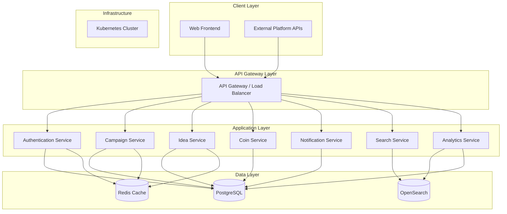

# Design Document

## Overview

The Coins for Change platform is a distributed, scalable ideation and prioritization system built on a microservices architecture using FastAPI, PostgreSQL, and OpenSearch. The system enables democratic decision-making through a coin-based allocation mechanism while maintaining proper governance, security, and performance across multiple concurrent campaigns.

The platform serves four distinct user personas through role-based interfaces, supports external platform integration via contextual permalinks, and provides comprehensive analytics and reporting capabilities. The design emphasizes scalability, maintainability, and extensibility to support organizational growth and evolving requirements.

## Architecture

### High-Level Architecture



### Service Architecture

The platform follows a microservices architecture with the following core services:

1. **Authentication Service** - User management, role-based access control, session management
2. **Campaign Service** - Campaign lifecycle, configuration, member management
3. **Idea Service** - Idea submission, approval workflow, duplicate detection
4. **Coin Service** - Coin allocation, reallocation, expiration, campaign boundaries
5. **Search Service** - Full-text search, fuzzy matching, content indexing
6. **Notification Service** - Email notifications, in-app notifications, preference management
7. **Analytics Service** - Reporting, metrics aggregation, dashboard data

### Technology Stack Integration

- **FastAPI**: RESTful API services with automatic OpenAPI documentation
- **PostgreSQL**: Transactional data, user accounts, campaigns, ideas, coin transactions
- **OpenSearch**: Full-text search, analytics, idea content indexing, fuzzy matching
- **Redis**: Session storage, caching, real-time notifications
- **Kubernetes**: Container orchestration, service discovery, scaling

## Components and Interfaces

### Core Data Models

#### User Management
```python
class User(Base):
    __tablename__ = "users"
    
    id: Mapped[UUID] = mapped_column(primary_key=True, default=uuid4)
    email: Mapped[str] = mapped_column(String(255), unique=True, index=True)
    hashed_password: Mapped[str] = mapped_column(String(255))
    full_name: Mapped[str] = mapped_column(String(255))
    is_active: Mapped[bool] = mapped_column(default=True)
    created_at: Mapped[datetime] = mapped_column(default=datetime.utcnow)
    
    # Relationships
    campaign_memberships: Mapped[List["CampaignMember"]] = relationship(back_populates="user")
    submitted_ideas: Mapped[List["Idea"]] = relationship(back_populates="submitter")
    coin_transactions: Mapped[List["CoinTransaction"]] = relationship(back_populates="user")

class SystemRole(Base):
    __tablename__ = "system_roles"
    
    id: Mapped[UUID] = mapped_column(primary_key=True, default=uuid4)
    user_id: Mapped[UUID] = mapped_column(ForeignKey("users.id"))
    role_type: Mapped[str] = mapped_column(String(50))  # admin, sponsor
    granted_at: Mapped[datetime] = mapped_column(default=datetime.utcnow)
```

#### Campaign Management
```python
class Campaign(Base):
    __tablename__ = "campaigns"
    
    id: Mapped[UUID] = mapped_column(primary_key=True, default=uuid4)
    campaign_id: Mapped[str] = mapped_column(String(100), unique=True, index=True)
    title: Mapped[str] = mapped_column(String(255))
    description: Mapped[str] = mapped_column(Text)
    campaign_type: Mapped[str] = mapped_column(String(20))  # open, mediated, closed
    status: Mapped[str] = mapped_column(String(20), default="draft")  # draft, active, completed, archived
    
    # Timing
    start_date: Mapped[Optional[datetime]]
    end_date: Mapped[Optional[datetime]]
    created_at: Mapped[datetime] = mapped_column(default=datetime.utcnow)
    
    # Visual assets
    banner_image_url: Mapped[Optional[str]] = mapped_column(String(500))
    icon_url: Mapped[Optional[str]] = mapped_column(String(500))
    
    # Relationships
    members: Mapped[List["CampaignMember"]] = relationship(back_populates="campaign")
    ideas: Mapped[List["Idea"]] = relationship(back_populates="campaign")
    tags: Mapped[List["CampaignTag"]] = relationship(back_populates="campaign")
    coin_policies: Mapped[List["CoinPolicy"]] = relationship(back_populates="campaign")

class CampaignMember(Base):
    __tablename__ = "campaign_members"
    
    id: Mapped[UUID] = mapped_column(primary_key=True, default=uuid4)
    campaign_id: Mapped[UUID] = mapped_column(ForeignKey("campaigns.id"))
    user_id: Mapped[UUID] = mapped_column(ForeignKey("users.id"))
    role: Mapped[str] = mapped_column(String(20))  # manager, member
    invited_at: Mapped[datetime] = mapped_column(default=datetime.utcnow)
    joined_at: Mapped[Optional[datetime]]
    
    # Relationships
    campaign: Mapped["Campaign"] = relationship(back_populates="members")
    user: Mapped["User"] = relationship(back_populates="campaign_memberships")
```

#### Idea Management
```python
class Idea(Base):
    __tablename__ = "ideas"
    
    id: Mapped[UUID] = mapped_column(primary_key=True, default=uuid4)
    campaign_id: Mapped[UUID] = mapped_column(ForeignKey("campaigns.id"))
    submitter_id: Mapped[UUID] = mapped_column(ForeignKey("users.id"))
    
    title: Mapped[str] = mapped_column(String(255))
    description: Mapped[str] = mapped_column(Text)
    status: Mapped[str] = mapped_column(String(20), default="pending")  # pending, approved, rejected, competing, accepted, in_progress, complete
    
    # Permalink context
    context_id: Mapped[Optional[str]] = mapped_column(String(100), index=True)
    permalink_source: Mapped[Optional[str]] = mapped_column(String(255))
    
    # Timestamps
    submitted_at: Mapped[datetime] = mapped_column(default=datetime.utcnow)
    approved_at: Mapped[Optional[datetime]]  # When moved to competing status
    accepted_at: Mapped[Optional[datetime]]  # When coins are expended
    started_at: Mapped[Optional[datetime]]   # When moved to in_progress
    completed_at: Mapped[Optional[datetime]] # When implementation is complete
    
    # Relationships
    campaign: Mapped["Campaign"] = relationship(back_populates="ideas")
    submitter: Mapped["User"] = relationship(back_populates="submitted_ideas")
    coin_allocations: Mapped[List["CoinAllocation"]] = relationship(back_populates="idea")
    tags: Mapped[List["IdeaTag"]] = relationship(back_populates="idea")

class CampaignTag(Base):
    __tablename__ = "campaign_tags"
    
    id: Mapped[UUID] = mapped_column(primary_key=True, default=uuid4)
    campaign_id: Mapped[UUID] = mapped_column(ForeignKey("campaigns.id"))
    name: Mapped[str] = mapped_column(String(100))
    description: Mapped[Optional[str]] = mapped_column(Text)
    color: Mapped[Optional[str]] = mapped_column(String(7))  # hex color
    created_at: Mapped[datetime] = mapped_column(default=datetime.utcnow)
    
    # Relationships
    campaign: Mapped["Campaign"] = relationship(back_populates="tags")
    idea_tags: Mapped[List["IdeaTag"]] = relationship(back_populates="tag")
```

#### Coin Economy
```python
class CoinPolicy(Base):
    __tablename__ = "coin_policies"
    
    id: Mapped[UUID] = mapped_column(primary_key=True, default=uuid4)
    campaign_id: Mapped[UUID] = mapped_column(ForeignKey("campaigns.id"))
    
    initial_allocation: Mapped[int] = mapped_column(default=100)
    idea_submission_reward: Mapped[int] = mapped_column(default=0)
    allow_reallocation: Mapped[bool] = mapped_column(default=True)
    allow_recycling: Mapped[bool] = mapped_column(default=True)
    
    # Relationships
    campaign: Mapped["Campaign"] = relationship(back_populates="coin_policies")

class CoinBalance(Base):
    __tablename__ = "coin_balances"
    
    id: Mapped[UUID] = mapped_column(primary_key=True, default=uuid4)
    user_id: Mapped[UUID] = mapped_column(ForeignKey("users.id"))
    campaign_id: Mapped[UUID] = mapped_column(ForeignKey("campaigns.id"))
    
    available_coins: Mapped[int] = mapped_column(default=0)
    allocated_coins: Mapped[int] = mapped_column(default=0)
    expended_coins: Mapped[int] = mapped_column(default=0)
    
    updated_at: Mapped[datetime] = mapped_column(default=datetime.utcnow, onupdate=datetime.utcnow)

class CoinAllocation(Base):
    __tablename__ = "coin_allocations"
    
    id: Mapped[UUID] = mapped_column(primary_key=True, default=uuid4)
    user_id: Mapped[UUID] = mapped_column(ForeignKey("users.id"))
    idea_id: Mapped[UUID] = mapped_column(ForeignKey("ideas.id"))
    campaign_id: Mapped[UUID] = mapped_column(ForeignKey("campaigns.id"))
    
    amount: Mapped[int]
    is_expended: Mapped[bool] = mapped_column(default=False)
    allocated_at: Mapped[datetime] = mapped_column(default=datetime.utcnow)
    expended_at: Mapped[Optional[datetime]]
    
    # Relationships
    idea: Mapped["Idea"] = relationship(back_populates="coin_allocations")
```

### API Interface Design

#### Authentication Endpoints
```python
# FastAPI route definitions
@router.post("/auth/login")
async def login(credentials: LoginRequest) -> TokenResponse:
    """Authenticate user and return JWT token"""

@router.post("/auth/register")
async def register(user_data: UserRegistrationRequest) -> UserResponse:
    """Register new user account"""

@router.post("/auth/refresh")
async def refresh_token(refresh_token: str) -> TokenResponse:
    """Refresh JWT access token"""
```

#### Campaign Management Endpoints
```python
@router.post("/campaigns")
async def create_campaign(campaign_data: CampaignCreateRequest) -> CampaignResponse:
    """Create new campaign (admin only)"""

@router.put("/campaigns/{campaign_id}")
async def update_campaign(campaign_id: str, updates: CampaignUpdateRequest) -> CampaignResponse:
    """Update campaign configuration (managers only)"""

@router.post("/campaigns/{campaign_id}/members")
async def invite_members(campaign_id: str, invitations: List[MemberInvitation]) -> InvitationResponse:
    """Invite users to campaign"""

@router.post("/campaigns/{campaign_id}/tags")
async def create_tag(campaign_id: str, tag_data: TagCreateRequest) -> TagResponse:
    """Create campaign tag"""
```

#### Idea Management Endpoints
```python
@router.post("/campaigns/{campaign_id}/ideas")
async def submit_idea(campaign_id: str, idea_data: IdeaSubmissionRequest) -> IdeaResponse:
    """Submit new idea to campaign"""

@router.get("/campaigns/{campaign_id}/ideas/similar")
async def find_similar_ideas(campaign_id: str, title: str) -> List[SimilarIdeaResponse]:
    """Find similar existing ideas using fuzzy matching"""

@router.put("/ideas/{idea_id}/status")
async def update_idea_status(idea_id: str, status_update: IdeaStatusUpdate) -> IdeaResponse:
    """Update idea status: approve->competing, accept->accepted, start->in_progress, complete->complete (managers only)"""
```

#### Coin Management Endpoints
```python
@router.post("/campaigns/{campaign_id}/coins/allocate")
async def allocate_coins(campaign_id: str, allocation: CoinAllocationRequest) -> AllocationResponse:
    """Allocate coins to idea"""

@router.post("/campaigns/{campaign_id}/coins/reallocate")
async def reallocate_coins(campaign_id: str, reallocation: CoinReallocationRequest) -> AllocationResponse:
    """Reallocate coins between ideas"""

@router.get("/campaigns/{campaign_id}/coins/balance")
async def get_coin_balance(campaign_id: str) -> CoinBalanceResponse:
    """Get user's coin balance for campaign"""
```

### Search Integration

#### OpenSearch Document Structure
```python
# Idea document for search indexing
idea_document = {
    "id": "uuid",
    "campaign_id": "campaign_uuid", 
    "title": "Idea title",
    "description": "Full idea description",
    "tags": ["tag1", "tag2"],
    "submitter_name": "User Name",
    "status": "competing",
    "coin_count": 150,
    "submitted_at": "2024-01-15T10:30:00Z",
    "context_id": "platform_feature_123"
}

# Search service implementation
class SearchService:
    async def index_idea(self, idea: Idea) -> None:
        """Index idea in OpenSearch for full-text search"""
        
    async def find_similar_ideas(self, title: str, description: str, campaign_id: str) -> List[SimilarIdea]:
        """Use fuzzy matching to find similar existing ideas"""
        
    async def search_ideas(self, query: str, filters: SearchFilters) -> SearchResults:
        """Full-text search across ideas with filtering"""
```

## Error Handling

### Error Response Structure
```python
class ErrorResponse(BaseModel):
    error_code: str
    message: str
    details: Optional[Dict[str, Any]] = None
    timestamp: datetime
    request_id: str

# Standard error codes
class ErrorCodes:
    AUTHENTICATION_FAILED = "AUTH_001"
    INSUFFICIENT_PERMISSIONS = "AUTH_002"
    CAMPAIGN_NOT_FOUND = "CAMPAIGN_001"
    CAMPAIGN_INACTIVE = "CAMPAIGN_002"
    INSUFFICIENT_COINS = "COIN_001"
    COINS_ALREADY_EXPENDED = "COIN_002"
    IDEA_NOT_FOUND = "IDEA_001"
    DUPLICATE_IDEA_DETECTED = "IDEA_002"
    IDEA_NOT_COMPETING = "IDEA_003"
    IDEA_ALREADY_ACCEPTED = "IDEA_004"
```

### Exception Handling Strategy
- **Authentication Errors**: Return 401 with clear error messages
- **Authorization Errors**: Return 403 with role requirements
- **Validation Errors**: Return 422 with field-specific error details
- **Business Logic Errors**: Return 400 with domain-specific error codes
- **System Errors**: Return 500 with sanitized error messages and request tracking

## Testing Strategy

### Unit Testing
- **Service Layer**: Test business logic with mocked dependencies
- **Repository Layer**: Test data access patterns with test database
- **API Layer**: Test endpoint behavior with FastAPI TestClient
- **Validation**: Test Pydantic models and custom validators

### Integration Testing
- **Database Integration**: Test PostgreSQL operations with test containers
- **Search Integration**: Test OpenSearch operations with test cluster
- **API Integration**: Test complete request/response cycles
- **Authentication Flow**: Test JWT token generation and validation

### End-to-End Testing
- **User Workflows**: Test complete user journeys from registration to coin allocation
- **Campaign Lifecycle**: Test campaign creation, configuration, and completion
- **Coin Economy**: Test coin allocation, reallocation, and expiration scenarios
- **Platform Integration**: Test permalink functionality and context tracking

### Performance Testing
- **Load Testing**: Simulate concurrent users and campaign activity
- **Search Performance**: Test OpenSearch query performance under load
- **Database Performance**: Test PostgreSQL query optimization
- **Caching Effectiveness**: Validate Redis caching strategies

### Security Testing
- **Authentication Security**: Test JWT token security and session management
- **Authorization Testing**: Verify role-based access controls
- **Input Validation**: Test against injection attacks and malformed data
- **Rate Limiting**: Test API rate limiting and abuse prevention

## Deployment Architecture

### Kubernetes Configuration
```yaml
# Campaign service deployment
apiVersion: apps/v1
kind: Deployment
metadata:
  name: campaign-service
spec:
  replicas: 3
  selector:
    matchLabels:
      app: campaign-service
  template:
    metadata:
      labels:
        app: campaign-service
    spec:
      containers:
      - name: campaign-service
        image: coins-for-change/campaign-service:latest
        ports:
        - containerPort: 8000
        env:
        - name: DATABASE_URL
          valueFrom:
            secretKeyRef:
              name: db-credentials
              key: url
        - name: OPENSEARCH_URL
          valueFrom:
            configMapKeyRef:
              name: search-config
              key: url
        resources:
          requests:
            memory: "256Mi"
            cpu: "250m"
          limits:
            memory: "512Mi"
            cpu: "500m"
        livenessProbe:
          httpGet:
            path: /health
            port: 8000
          initialDelaySeconds: 30
          periodSeconds: 10
        readinessProbe:
          httpGet:
            path: /ready
            port: 8000
          initialDelaySeconds: 5
          periodSeconds: 5
```

### Service Mesh Integration
- **Istio**: Service-to-service communication, traffic management, security policies
- **Security**: mTLS between services, network policies, rate limiting

### Monitoring and Observability (OpenTelemetry)
- **Distributed Tracing**: OpenTelemetry tracing with Jaeger or Zipkin backend
- **Metrics Collection**: OpenTelemetry metrics with Prometheus backend
- **Application Metrics**: FastAPI request metrics, custom business metrics (coin allocations, idea submissions)
- **Infrastructure Metrics**: Kubernetes cluster metrics, resource utilization via OpenTelemetry Collector
- **Logging**: Structured logging with OpenTelemetry correlation IDs, centralized aggregation
- **Alerting**: Prometheus AlertManager for proactive alerts on system health, performance degradation, business metrics
- **Dashboards**: Grafana dashboards for real-time monitoring and analytics